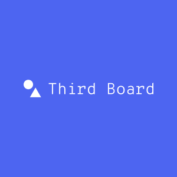

<p align="center">
    
</p>
<div align="center">
  <h3 align="center">
  Third Board
  </h3>
</div>

<div align="center">

**Third Board** is a lightweight, self hosted, fast alternative to dework. a fully customizable project management solution leveraging on decentralized storage and NFT gated authentication.

</div>

[click here to learn how to build it yourself](https://mirror.xyz/anyaogu.eth/Pf__G5CTqExqXYpbrjQcUfr6mMiJaDf1GCGMAn7TWro)

## Contracts

All NFT pass contracts are available in most evm chains at this address

`0x41a8947368feb2d8e6694daa05162cf8e4106a9d`
chains deployed to include

_ `optimism testnet` _ `gnosis choida testnet` _ `scroll alpha testnet` _ `mantle testnet` _ `polygon zkevm testnet` _ `taiko testnet` \_

excluding : _ `goerli` _ and _ `base testnet` _ which is deployed at `0xf609c8fe0e04492065fcf9e9ac015b43e69d219d`

## Demo

Paste your address in the url `https:://third-board.vercel.app/<your address here>`
if you don't have a **Pass NFT** you will be able to mint one for yourself.
If its not able to mint one for you (probably out of gas), transfer **goerliEth** to this address `0x6394f2E9660a2D718ca03F9316F0e89c82CF85BA` and try again.

## Usage

> This is a self hosted application.
> you have to host it yourself, or try the [demo](https://third-board.vercel.app).

- step 1

clone the repository

```sh
git clone https://github.com/peteruche21/EXM-kanban.git
```

- step 2

copy rename the .env.example and provide the required vars

```sh
cp .env.example .env
```

- step 3

Setup up the NFT pass contract.
We will be using **goerli** because whal3s NFT validation surpports just a few chains for now.
Ensure that you have your **private key**, **goerli rpc** and **etherscan api key** in your environment variables.
Follow this [guide]("https://book.getfoundry.sh/getting-started/installation") if you don't have foundry installed.

You can obtain a free _RPC NODE URL_ from [quicknode]("https://www.quicknode.com/")

```sh
yarn forge:clean

yarn forge:install

yarn forge:build

yarn forge:test

yarn forge:deploy chain=goerli

# you can deploy to other chains by specifying chain=<chain name>
```

- step 4

Get your **whal3s** API KEY and set up your NFT Validation Utility by following this guides in the [docs]("https://docs.whal3s.xyz/")

- step 5

Add your constants. [here](./src/constants/index.ts)

1. **contractAddress** - replace with the address of the new deployed `passNFT`.
2. **nftValidationKey** - replace with the NFT Utility key from step 4
3. **whal3sApiKey** - add your API key from step 4 in the _.env_ file.
4. **namespace** - replace with your Database name/identifier.

- step 6

The application uses [polybase]("https://polybase.xyz") by default, but you can configure it yourself to use [execution machine]("https://exm.dev")
by deploying the `EXM functions`.

Create an account on [exm website]("https://exm.dev") and get an **api token/key** make sure you have [EXM cli]("https://docs.exm.dev/cli/introduction") installed.

```sh
exm function:deploy --src src/exm/function.js --init-state '{ "tasks": [], "archive": [], "projects": [] }' --token <your exm api token/key here>

```

Update the constants with the generated **exmFnId**, **exmFnSource** and **exmFnUrl**.
also add your _EXM_KEY to your _.env\_

you can also add support for other Decentralized Database Solution.

- step 7

Edit [mint.tsx](./src/views/Mint.tsx) to use a `web3 wallet` instead of `private key` for transaction signing. By default only the `pass NFT` owner can mint/burn nfts.

## Client

```sh
# install dependencies
yarn
# run local development server
yarn dev
# build for production
yarn vite:build
# preview build
yarn preview
```

the application is built using:

- [Typescript](https://www.typescriptlang.org/)
- [Vite](https://vitejs.dev/)
- [Tailwindcss](https://tailwindcss.com)
- [Blocknative](https://onboard.blocknative.com/)
- [Whal3s](https://whal3s.xyz)
- [foundry](https://book.getfoundry.sh/)
- [Quicknode](https://www.quicknode.com)
- [Polybase](https://polybase.xyz)
- [EXM](https://exm.dev)
- [Daisy UI](https://daisyui.com)

So you can **customize** pretty much **everything** and **deploy** it anywhere including [GCP](https://cloud.google.com), [AWS](https://aws.amazon.com), [azure](https://azure.microsoft.com), [vercel](https://vercel.com/), [render](https://render.com), [netlify](https://www.netlify.com) etc.
If you love `make build` then you would like a `do it yourself` kinda application.
